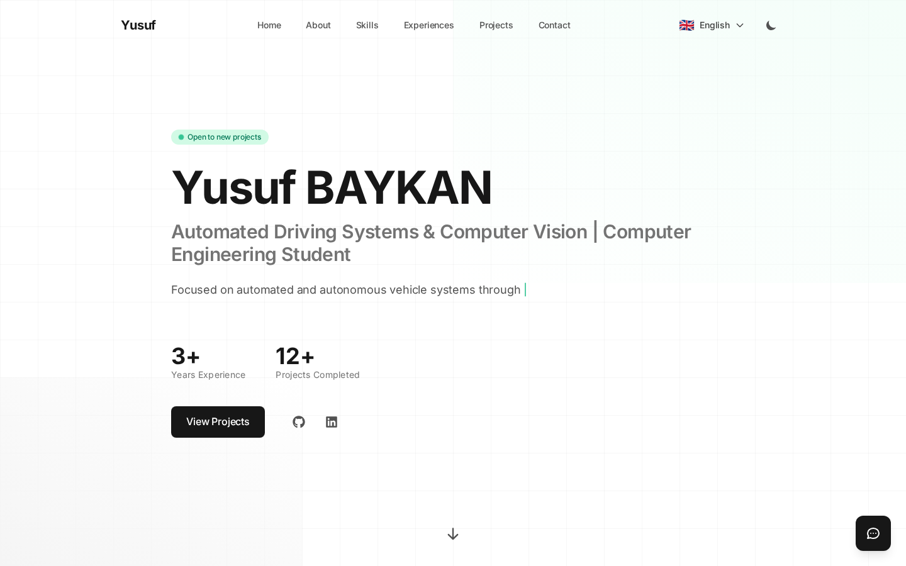

# Yusuf Portfolio

Modern, minimal, multilingual (i18n) portfolio website with an admin panel and a configurable chatbot.

- Public site: About / Skills / Experiences / Projects / Contact
- Admin panel: content management (CRUD), messages, settings, translations
- Backend: Express + SQLite (better-sqlite3) + JWT auth + file uploads

## Live

- https://yusufbaykan.com

## Screenshots



---

## Tech Stack

**Frontend**: React 18, Vite, TailwindCSS, Framer Motion, Zustand, React Router, Axios

**Backend**: Node.js, Express, SQLite (better-sqlite3), JWT, bcryptjs, multer, helmet, express-rate-limit

---

## Project Structure

```
.
├─ client/                 # React (Vite)
├─ server/                 # Express API
├─ docs/                   # Detaylı dokümantasyon
└─ package.json            # Root script'ler (concurrently)
```

For detailed architecture notes:
- docs/README.md
- docs/endpoints/API.md
- docs/DESIGN_SYSTEM.md

---

## Quick Start (Development)

### Requirements

- Node.js 18+ (recommended)
- npm

### Install

```bash
npm run install:all
```

### Environment Variables (Backend)

Create `server/.env`:

```bash
cp server/.env.example server/.env
```

Minimum required variables:

- `PORT` (default: `7847`)
- `JWT_SECRET` (make sure to change in production)
- `NODE_ENV` (`development` | `production`)
- `CLIENT_URL` (only for production CORS)

### Run

```bash
npm run dev
```

- Frontend: `http://localhost:8847`
- Backend API: `http://localhost:7847/api`
- Health check: `http://localhost:7847/api/health`

Note: In development, the frontend proxies `/api` and `/uploads` requests to the backend via Vite proxy (client/vite.config.js).

---

## Admin Panel

- Login: `http://localhost:8847/admin/login`

Default credentials (seeded on first setup):
- Username: `admin`
- Password: `admin123`

> Change the admin password before deploying to production.

---

## Database

- SQLite file: `server/database/portfolio.db`
- Schema + seed: `server/database/init.js`

When the backend starts, `server/server.js` automatically runs `init.js` and creates the database file if it does not exist.

---

## Production

In this project, the backend also serves the frontend build output in production mode.

```bash
npm run build
# sonra
cd server && NODE_ENV=production npm start
```

For CORS origin checks in production, `CLIENT_URL` must be defined in `server/.env`.

---

## API Documentation

Endpoint list: docs/endpoints/API.md

All endpoints are prefixed with `/api`.

---

## License

MIT
